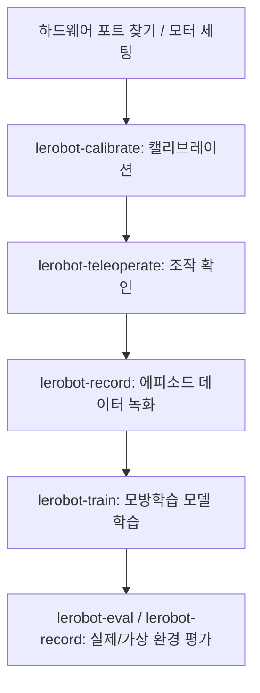

# LeRobot 코드 분석 및 아키텍처 정리

[LeRobot](https://github.com/huggingface/lerobot)은 Hugging Face에서 개발하는 PyTorch 기반의 실세계 로보틱스(Real-world Robotics)를 위한 라이브러리입니다. 모방 학습(Imitation Learning) 모델의 학습, 데이터셋 관리, 시뮬레이션 환경 평가, 실제 하드웨어 제어 및 텔레오퍼레이션(Teleoperation)까지 원스톱으로 지원합니다.

---

## 1. 핵심 아키텍처 및 구성 요소 (`src/lerobot/`)

LeRobot 코드는 객체 지향적이고 확장성이 뛰어난 모듈식 설계를 따르고 있습니다. 핵심 폴더별 구조와 역할은 다음과 같습니다.

### 📁 [datasets](file:///home/tombin1204/lerobot/src/lerobot/datasets/) (데이터셋 관리)
* **[lerobot_dataset.py](file:///home/tombin1204/lerobot/src/lerobot/datasets/lerobot_dataset.py)**: 로봇 데이터셋을 효율적으로 다루기 위한 핵심 클래스 `LeRobotDataset`이 정의되어 있습니다. 에피소드 단위 샘플링, 비디오 디코딩(frame extraction) 등을 관리하며, Hugging Face Hub와 연동하여 데이터셋 업로드/다운로드를 지원합니다.
* **[lerobot_dataset_metadata.py](file:///home/tombin1204/lerobot/src/lerobot/datasets/lerobot_dataset_metadata.py)**: 데이터셋의 메타데이터(카메라 정보, FPS, 태스크 설명 등)를 관리합니다.

### 📁 [policies](file:///home/tombin1204/lerobot/src/lerobot/policies/) (로봇 제어 알고리즘)
* 다양한 모방 학습 정책(Imitation Learning Policy)을 담고 있으며, 모두 nn.Module과 Hugging Face HubMixin을 상속받는 `PreTrainedPolicy` ([pretrained.py](file:///home/tombin1204/lerobot/src/lerobot/policies/pretrained.py)) 기반으로 구현됩니다.
* **주요 정책 폴더**:
  * [act](file:///home/tombin1204/lerobot/src/lerobot/policies/act/) (Action Chunking with Transformers): 빠르고 적은 메모리로 싱글 태스크 학습에 유용.
  * [diffusion](file:///home/tombin1204/lerobot/src/lerobot/policies/diffusion/): 다중 모드 행동 분포를 처리하는 디퓨전 기반 제어 정책.
  * [smolvla](file:///home/tombin1204/lerobot/src/lerobot/policies/smolvla/): 언어 지시와 멀티 태스크 학습이 가능한 경량 VLA(Vision-Language-Action) 모델.
* **[factory.py](file:///home/tombin1204/lerobot/src/lerobot/policies/factory.py)**: 설정값(Config)에 따라 필요한 정책 인스턴스를 동적으로 생성해 주는 팩토리 역할을 합니다.

### 📁 [processor](file:///home/tombin1204/lerobot/src/lerobot/processor/) (데이터 전처리 파이프라인)
* 데이터셋의 가공되지 않은 센서 데이터를 학습 정책에 맞게 정규화하거나 포맷을 바꾸는 변환 파이프라인입니다.
* `DataProcessorPipeline` 및 `PolicyProcessorPipeline` 등을 통해 상태(state), 액션(action), 이미지 데이터를 체인(chain) 형태로 변환합니다.

### 📁 [envs](file:///home/tombin1204/lerobot/src/lerobot/envs/) (시뮬레이션 환경)
* **[configs.py](file:///home/tombin1204/lerobot/src/lerobot/envs/configs.py)**: 시뮬레이션 환경의 설정을 정의하는 `EnvConfig`를 포함합니다.
* **[factory.py](file:///home/tombin1204/lerobot/src/lerobot/envs/factory.py)**: Gymnasium 규격을 따르는 시뮬레이션 환경(Aloha, PushT, LIBERO, MetaWorld 등)을 생성하는 `create_envs()` 팩토리 함수를 포함합니다.

### 📁 하드웨어 추상화 모듈
실제 하드웨어를 제어하기 위해 센서(카메라), 모터, 링크 구조 등을 객체화한 계층입니다.
* **[robots](file:///home/tombin1204/lerobot/src/lerobot/robots/)**: 물리 로봇의 결합 구조를 나타내는 클래스들이 포함됩니다.
* **[motors](file:///home/tombin1204/lerobot/src/lerobot/motors/)**: 서보모터(Feetech, Dynamixel, Damiao 등)와 통신(CAN, Serial 등)하는 저수준 제어를 담당합니다.
* **[cameras](file:///home/tombin1204/lerobot/src/lerobot/cameras/)**: OpenCV, Intel RealSense 카메라의 영상을 캡처하고 프레임을 동기화합니다.
* **[teleoperators](file:///home/tombin1204/lerobot/src/lerobot/teleoperators/)**: 리더 암(Leader Arm)이나 게임패드 등의 장치를 이용해 팔로워 로봇(Follower)을 텔레오퍼레이션하기 위한 리더 제어 모듈입니다.

---

## 2. 주요 워크플로우

사용자 및 개발자는 다음 CLI 스크립트들을 통해 하드웨어 제어부터 학습까지 전체 파이프라인을 실행합니다.

1. **포트 탐색 및 세팅**: [lerobot-find-port](file:///home/tombin1204/lerobot/src/lerobot/scripts/lerobot_find_port.py) 및 [lerobot-setup-motors](file:///home/tombin1204/lerobot/src/lerobot/scripts/lerobot_setup_motors.py)를 통해 장치 포트 설정
2. **캘리브레이션**: [lerobot-calibrate](file:///home/tombin1204/lerobot/src/lerobot/scripts/lerobot_calibrate.py)를 사용해 관절 가동 범위를 기록
3. **데이터 녹화**: [lerobot-record](file:///home/tombin1204/lerobot/src/lerobot/scripts/lerobot_record.py)를 사용해 리더-팔로워 간 텔레오 조작 데이터를 수집 및 저장
4. **학습**: [lerobot-train](file:///home/tombin1204/lerobot/src/lerobot/scripts/lerobot_train.py)을 구동하여 로보틱스 트랜스포머/디퓨전 모델 학습
5. **평가**: [lerobot-eval](file:///home/tombin1204/lerobot/src/lerobot/scripts/lerobot_eval.py) 또는 `lerobot-record --policy.path=...`를 통해 학습된 정책 구동

---

## 3. 최근 변경 사항 (reBot 통합)

가장 최근 커밋에 따라 다음 디바이스 정보가 새로 추가되었습니다.
* **`rebot_b601_follower`**: 단일 팔(single-arm) 6-DOF + 그리퍼 구성의 B601-DM 팔로워 로봇 (`motorbridge`와 Damiao CAN 모터를 활용).
* **`rebot_102_leader`**: 단일 팔 스타암(StarArm) 102 리더 장치 (`motorbridge-smart-servo` 및 FashionStar UART 서보를 활용).
* 이 외에도 양팔(Bimanual) 구성을 지원하는 `bi_rebot_b601_follower` 및 `bi_rebot_102_leader` 컴포지트 클래스가 추가되었으며, 각 관절의 각도 매핑 및 캘리브레이션 편의 기능이 보완되었습니다.

---

## 4. 환경 설정 및 개발 명령어

### 기술 스택
* **Python**: >=3.12
* **PyTorch**: 2.7 ~ 2.11.0 (cu128 기본 탑재)
* **패키지 관리**: `uv` 또는 `conda`

> [!NOTE]
> 개발 시, `uv run pytest tests`를 통해 린팅 및 유닛 테스트(pytest)를 쉽게 실행할 수 있습니다. 
